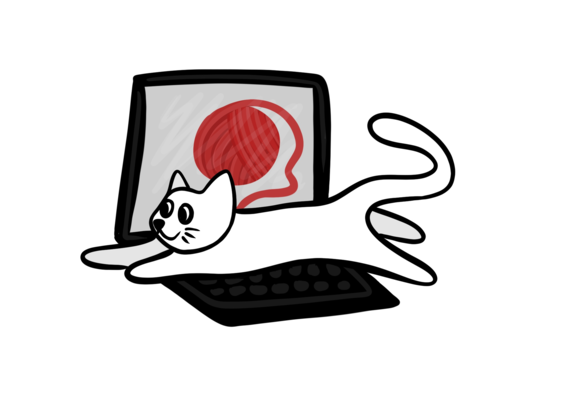

# script-kitty

## Get your scripts together

## The Problem ##

We've all been there. You configure this one thing, tweak another thing and seemingly out of nowhere you find your bash environment is basically its own custom operating system! Of course, this happens incrementally, so that as long as you are working on your own machine, you are in a perpetual state of workflow bliss, masterfully navigating between obscure menus and running strange scripts on random dotfiles. 

But what happens when you need to log into another computer? Panic. Pandemonium. "Oh no my custom aliases do nothing!" you exclaim, wincing at the thought of having to type out all 7 command line flags for that one AWS command. 

## The Kitty ##

Script kitty is meant to be systematic solution to all of your terminal environment woes. Still in early development, script kitty imposes a common-sense framework on your dumpster fire of a bash config and makes it so that if you ever need to move computers, you can just use your kitty config file to install your custom scripts and manage their configurations. Gone are the days of going repo by repo, trying to figure out where that one alias is on Github. Script kitty is here to help.

## Rulez ##

  * Script kitty by default will source the file in your directory with the same name as the repo. This means that whatever functions or aliases you have should probably be in a file with the same name as whatever repositories you want to use. 
  * If you have pre-written installers, they should bein a file with the same name as the repo and have the extension .install. This will get run when `kitty install` gets run after the initiall repo pull. If that doesn't work, you can try to fix the installer file and run it with `kitty setup`. 
  * If you're a kind soul and want to provide an uninstaller, provide a script with the same name as the repo and the extension .uninstall. This will get run when `kitty remove` is called and should clean up any potential garbage your script generates on a system.

#### Disclaimer ####

Script kitty is in *very* early development, and is something of a side project. Feel free to contribute and give feedback but don't go into this thinking everything will work purrfectly.
